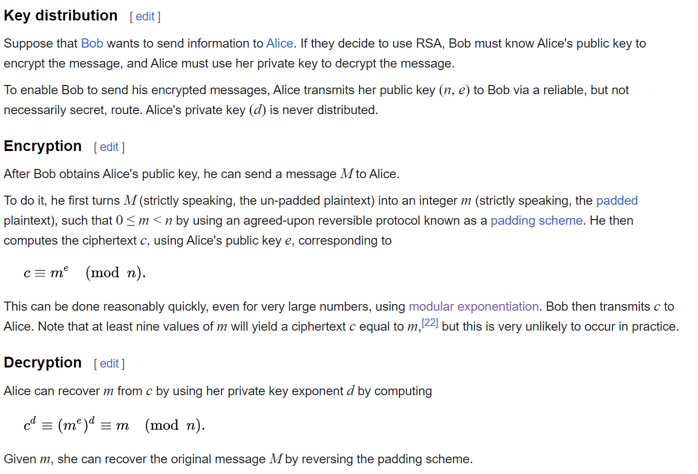

# RSA Encryption with JSEncrypt

## Overview

This project demonstrates RSA encryption and decryption using the JSEncrypt library in a web application. The JSEncrypt library is a JavaScript library used for RSA encryption, decryption, and key generation. It allows us to generate an RSA key pair, encrypt a message using the public key, and decrypt a message using the private key. This powerful tool helps secure data communication and ensures the privacy of sensitive information.
## RSA

RSA is an asymmetric cryptographic algorithm, which means that it involves two separate keys for encryption and decryption, and each party in the communication process possesses its own pair of keys.

Asymmetric cryptography contrasts with symmetric cryptography, where the same key is used for both encryption and decryption. In a symmetric encryption scheme, both the sender and the recipient need to possess and share the same secret key, which can become a logistical challenge, especially when communicating over an insecure channel.
[RSA Wiki](https://en.wikipedia.org/wiki/RSA_(cryptosystem))
 
 

 
 

## URL for End Result Project
[Click here to see the project](https://64bc00bb846f6e01633956b6--amanarab.netlify.app/rsa.html)
 
 
 
 

## Table of Contents

- [Introduction](#introduction)
- [Key Features](#key-features)
- [Getting Started](#getting-started)
- [Usage](#usage)
- [Technologies Used](#technologies-used)
- [Styling](#styling)
- [Contributing](#contributing)
- [License](#license)

## Dependencies

To implement RSA encryption and decryption, we utilize the JSEncrypt library. Instead of hosting the library on our server, we use a Content Delivery Network (CDN) to load the library. The JSEncrypt library is available on the CDN at:

[https://cdnjs.cloudflare.com](https://cdnjs.cloudflare.com/ajax/libs/jsencrypt/3.3.2/jsencrypt.min.js)

## Introduction

The RSA Encryption project provides a simple web application that allows users to generate an RSA key pair, encrypt messages with the public key, and decrypt messages using the private key. The project is built using HTML, CSS, and JavaScript, with the JSEncrypt library handling the RSA encryption and decryption functionality.

## Key Features

- Generate RSA key pair of various sizes (512 bits, 1024 bits, 2048 bits, and 4096 bits).
- Encrypt plaintext messages with the generated public key.
- Decrypt ciphertext messages using the corresponding private key.
- Clear/reset textareas with a single click.

## Getting Started

To get started with the project, follow these steps:

1. Clone the repository: `git clone` [Clone: ](https://github.com/AMAN-ARABZADEH/RSA_JS)
2. Open the `index.html` file in your web browser.

## Usage

To use the application, follow these steps:

1. Clone this repository to your local machine or fork it on GitHub.
2. Open the `index.html` file in your web browser.
3. Choose the desired key size from the dropdown list.
4. Click the "Generate Key Pair" button to generate the RSA key pair.
5. The generated public key and private key will be displayed in their respective text areas.
6. Enter the plaintext message in the "Encrypt Message" section.
7. Click the "Encrypt" button to encrypt the message using the public key.
8. The encrypted message will be displayed in the "Encrypted Result" text area.
9. Enter the ciphertext message in the "Decrypt Message" section.
10. Click the "Decrypt" button to decrypt the message using the private key.
11. The decrypted message will be displayed in the "Decrypted Result" text area.

## Technologies Used

- HTML
- CSS
- JavaScript
- JSEncrypt library (CDN link: https://cdnjs.cloudflare.com/ajax/libs/jsencrypt/3.3.2/jsencrypt.min.js)

## Styling

The user interface of the application is styled using CSS, with attention to color schemes that are suitable for colorblind users. The colors used aim to provide better visibility and accessibility for all users.

## Contributing

Contributions are welcome! If you find any issues or want to add new features, feel free to open an issue or submit a pull request.

## License

This project is open-source and available under the MIT License. You can find the license details in the [MIT License](./LICENSE) file.

This application is intended for educational purposes and to showcase the use of RSA encryption in web applications using the JSEncrypt library, CDN. It is not suitable for production use without further security measures and enhancements.
